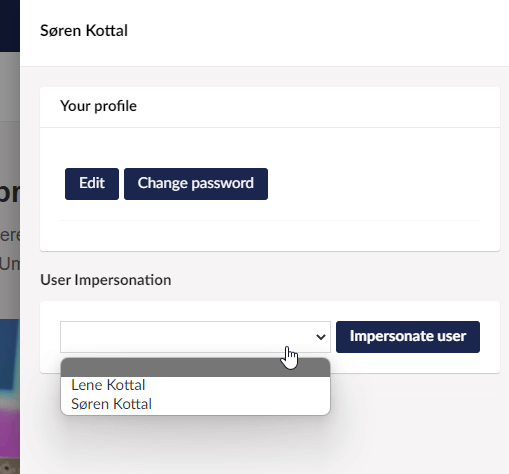

# Impersonator

[](https://www.nuget.org/packages/Our.Umbraco.Impersonator)
[](https://our.umbraco.com/packages/website-utilities/impersonator/)

Impersonator for Umbraco 10+ lets administrators impersonate other users.

This is useful in cases where you need to check the permissions of editors and other users, if you don't know, or don't want to know their passwords.

When Impersonator is installed, and you are logged in as a user with access to the Users section in Umbraco, you can click your avatar in the upper right corner to impersonate another user.



When impersonating another user, the user dialog is used to end impersonation.


## Getting started

### Installation

Impersonator can be installed in Umbraco 10 using the dotnet cli by running the following command:

```
dotnet add package Our.Umbraco.Impersonator
```

---

## Contributing to this project

Anyone and everyone is welcome to contribute. Please take a moment to review the [guidelines for contributing](CONTRIBUTING.md).

- [Bug reports](CONTRIBUTING.md#bugs)
- [Feature requests](CONTRIBUTING.md#features)
- [Pull requests](CONTRIBUTING.md#pull-requests)

## Contact

Have a question?

- [Raise an issue](https://github.com/skttl/Our.Umbraco.Impersonator/issues) on GitHub

## Dev Team

- [Søren Kottal](https://github.com/skttl)

### Special thanks

- Thanks to [Casey Neehouse](https://github.com/neehouse) for the original idea and code example.
- Thanks to Luis Prado for the icon [Impostor from NounProject.com](https://thenounproject.com/icon/impostor-4583/).

## License

Copyright &copy; 2022 Søren Kottal

Licensed under the [MIT License](LICENSE.md)
